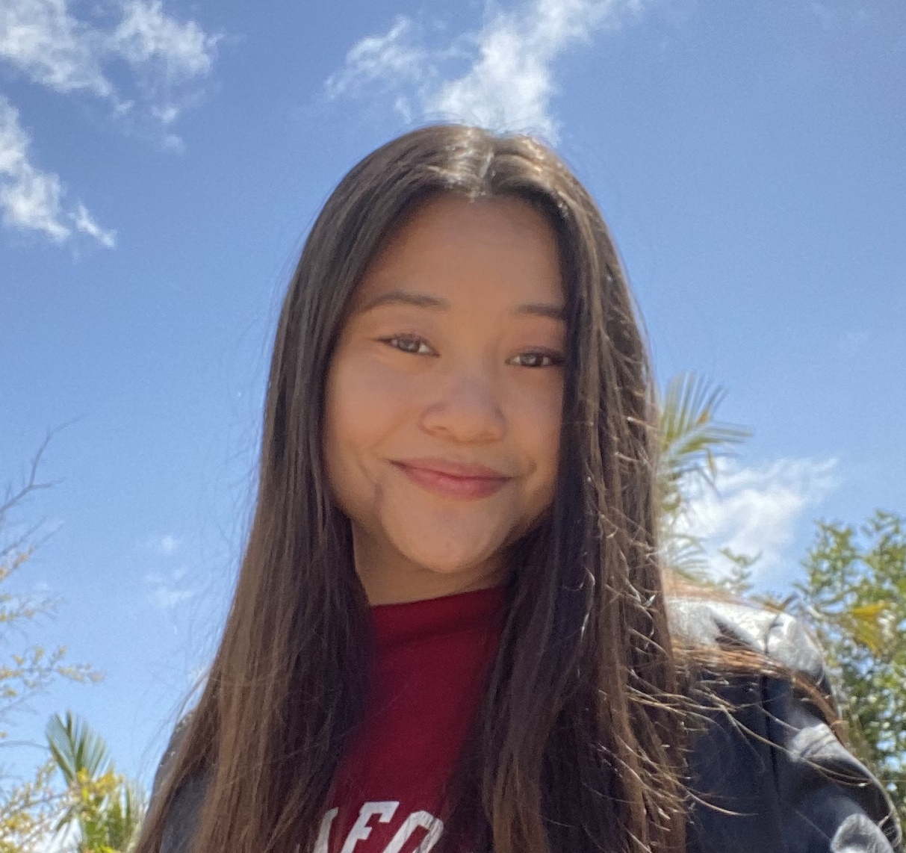

# Welcome to Manda's User Page



Hi, my name is Manda Tran and I am a fourth-year math-computer science major at UCSD.

You can learn more about me by clicking on one of the following:
* [Main Site](https://mandatran.github.io/)
* [LinkedIn](https://www.linkedin.com/in/manda-tran/)
* [GitHub](https://github.com/mandatran)

## Table of Contents
- [Welcome to Manda's User Page](#welcome-to-mandas-user-page)
  - [Research Interests](#research-interests)
  - [Personal Interests](#personal-interests)
  - [Summary](#summary)
  - [Goals](#goals)

## Research Interests
I am interested in the intersection of *computer science* and *mathematics*. Post graduation I will be pursuing a master's in conmputer science with a concentration in **security and cryptography**.

I am currently an undergraduate researcher where I am performing data analysis on dark net data collected by the largest network telescope.

## Personal Interests
I like drawing, eating breakfast, true crime (and fake crime @CriminalMinds), and wasting time on Pinterest.

Here's a Starbucks drink order you've been sleeping on:
* Grande Nitro Cold Brew
  * add 3 pumps of Mocha sauce
  * splash of ~~milk~~ ***almond milk***

### Here's a quote I live by

> The only thing I can't have is dairy!

## Summary
But oops, I apologize if that was a lot of information. Maybe if it was presented in a more comprehensible language:
```java
class Manda {
    int year = 4;
    String school = "UCSD";
    String major = "Math-CS";
    String [] likes = ["math", "web dev", 
        "croissants", "cold brew", "sushi",
        "pandas", "new girl", "painting",
        "a challenge ;)"];
    String [] dislikes = ["lactose"];

    void changeSchool (String gradSchool) {
        school = gradSchool;
    }
    
    void major (String gradMajor) {
        major = gradMajor;
    }
}
```

## Goals
For future Manda:
- [x] finish this lab
  - relative links:
    - [command line](screenshots/gitCommandLine.png)
    - [VSCode UI](screenshots/vsCodeUI.png)
- [ ] get that B.S.
- [ ] get that M.S.
- [ ] get job